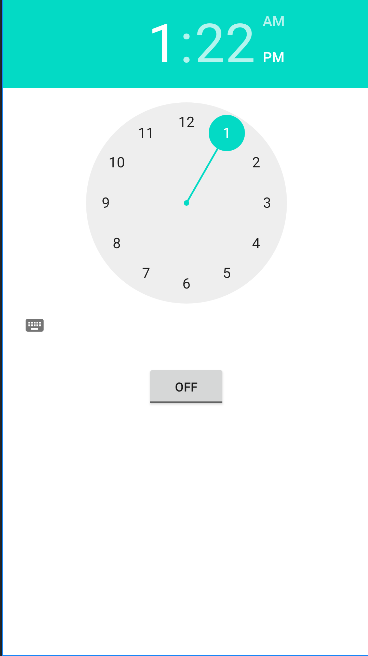

# Android Alarm Clock

## What you built?

I built a simple alarm clock in android for setting and triggering alarms.

## Who Did What?

Completed alone.

## What you learned

I learned android development, more specifically, how the views in android work, and how to use the different APIs (such as broadcast receiver) to perform functionalities in the app. While I've done android programming before, the last time I built anything in android was in high school. Since then, a lot has changed, notably a shift from java to kotlin. While I didn't use kotlin for this project, it's something that I'd definitely look to use in the future.

## How this relates

This relates to our pitch idea because our idea involves creating an alarm clock that incentivizes you to wake up. While I didn't work on any incentives, e.g. venmo integration, this represents the first part of project, the alarm portion. To continue, we'd need to additionally add some payments integration and other views for tracking commitment.

## What didn't work
I chose to make an android app because I don't have a mac and can't do iOS development. However, I don't own an android phone and was unable to get the android emulator working on my laptop, so I haven't been able to interact with/test the alarm functionality. However, the app compiles in gradle and I can see the views through the layout files.

## Thoughts on android development
Overall, android development seems a lot more straightforward than the last time I worked on it. It's still a bit confusing how there are so many different folders for app layouts and manifests, but as I have more experience approaching this than before, I'm able to better understand how all the parts connect and relate to each other. Compared to when I tried iOS development a few months ago, android development seems a lot more similar than it used to be, as it seems the two ecosystems are moving closer together from a development point of view.

## Authors

Austin Zhang

## Acknowledgments

[GeeksForGeeks Alarm Clock Tutorial](https://www.geeksforgeeks.org/how-to-build-a-simple-alarm-setter-app-in-android/)

[LearnToDroid Alarm Clock Tutorial](https://learntodroid.com/how-to-create-a-simple-alarm-clock-app-in-android/)
